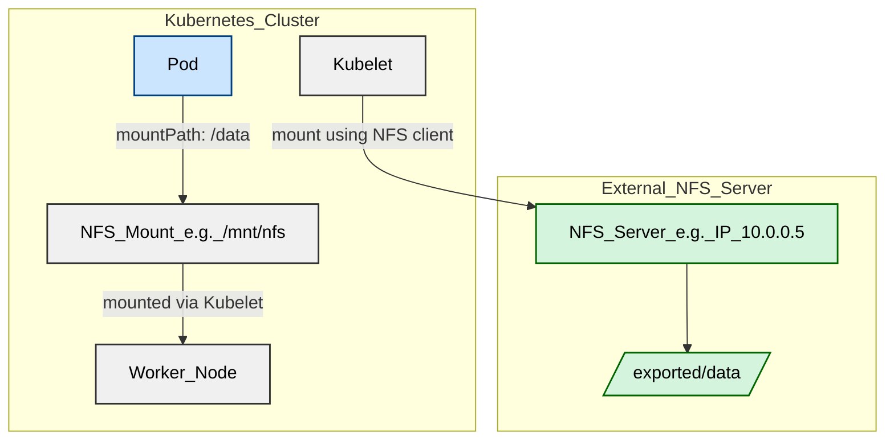

# CSI DRIVERS

## Different types of volume mount

### 1. HostPath

Not CSI-compliant (usually used for dev/testing).

Mounts a path from the node's local filesystem directly.

Node-local, not portable, and not recommended for production.

### 2. NFS (File storage)

Shared file system (remote).

Often backed by traditional NFS servers.

CSI drivers like nfs-subdir-external-provisioner allow dynamic provisioning.

CSI driver typically just mounts NFS using standard Linux tools (no FUSE or special logic needed).

| Aspect                 | **NFS**                                    | **FUSE-based FS (e.g., s3fs)**                     |
|------------------------|--------------------------------------------|----------------------------------------------------|
| **Where it runs**      | In **kernel space**                        | In **user space**                                  |
| **Interception layer** | Handled by **kernel NFS client**           | Handled by a **user process via FUSE**             |
| **Protocol/API used**  | NFS RPC (standard POSIX over network)      | Custom API (e.g., S3 HTTP, Google Cloud API)       |
| **Performance**        | Faster (kernel-level, optimized)           | Slower (context switches + user-space overhead)    |
| **Stability**          | Mature, well-tested                        | Depends on implementation; often less stable       |
| **Caching**            | Handled efficiently by kernel              | Varies; often limited or manual                    |
| **Security & isolation**| Stronger by default (kernel-managed)       | Needs extra care (FUSE processes can misbehave)    |

### 3. Distributed storage (e.g., Ceph, Longhorn, GlusterFS, Portworx)

Designed to be cluster-aware and resilient.

CSI drivers provide block or file storage, usually across multiple nodes.

Handle provisioning, attaching, and mounting — often using custom daemons or agents.

Volumes are replicated, rescheduled, and managed dynamically.

#### 📦 Example: s3fs

If you use s3fs, you're using a FUSE-based filesystem that:

Lives entirely in user space.

Intercepts filesystem calls (like ls, cat, echo "foo" > file.txt) via the kernel's FUSE interface.

Translates those into S3 API calls (like GET, PUT).

Streams data back and forth.

### 4. Cloud-based storage 

#### Object Storage (e.g., S3, Azure Blob, GCS)

Object storage, not block/file.

Not natively mountable in a POSIX way.

When used via CSI, they need:

A CSI driver, AND A FUSE layer (e.g., s3fs, rclone, goofys) to "pretend" it's a filesystem.

The CSI driver mounts a FUSE-backed path, and the FUSE tool converts read/write operations into API calls (GET, PUT, etc.).

> FUSE (Filesystem in Userspace) is a Linux kernel feature that lets you create a custom filesystem in user space, without writing kernel code.

#### Cloud Block Storage (e.g., AWS EBS, Azure Disk) 

Only object stores like S3, Azure Blob, and GCS need a FUSE layer when you want to mount them as a volume.

In contrast, cloud block storage does not need FUSE — they are real block devices and can be attached and mounted directly by the kernel via CSI.

## CSI Interface

CSI defines three main services:

| Service    | What it does                                      |
|------------|---------------------------------------------------|
| Identity   | Declares driver info and health.                 |
| Controller | Handles CreateVolume, DeleteVolume, and Attach.  |
| Node       | Handles Mount, Unmount, and NodeGetVolumeStats.  |

All CSI-compliant drivers (regardless of storage type) implement these — though not every driver uses every method (e.g., NFS may not implement Attach because it's not node-specific).

