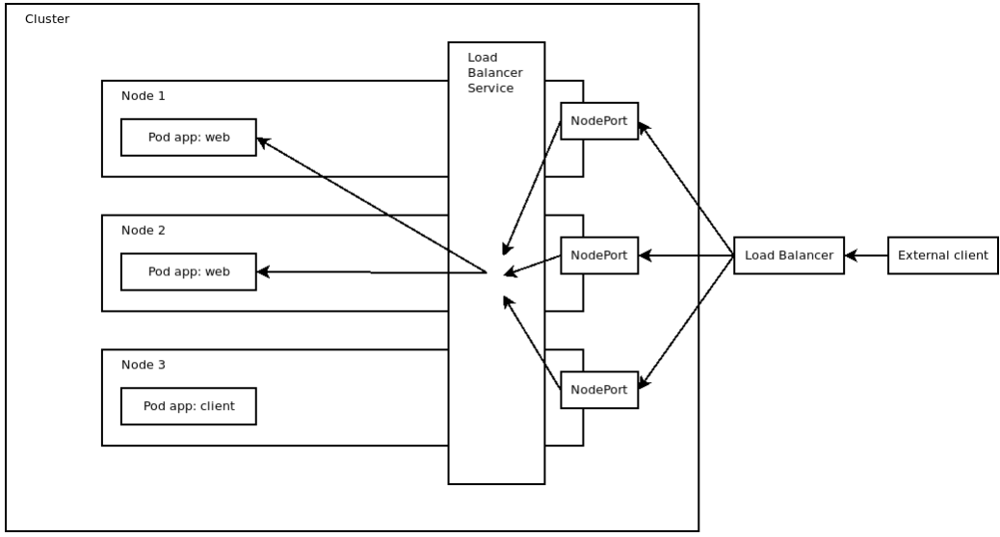

# KUBE

- [KUBE](#kube)
  - [1. Network](#1-network)
    - [1.1 Services](#11-services)
    - [3. Network Policies](#3-network-policies)
  - [2. Use Cases](#2-use-cases)
    - [2.1 Create a token to connect to the kube api](#21-create-a-token-to-connect-to-the-kube-api)

## 1. Network

### 1.1 Services

3 types de services : NodePort, ClusterIP, LoadBalancer

- ClusterIP (Default) : Exposer un ensemble de pod, possédant des lables commun matché par le service, en interne dans le cluster. Seul moyen d'atteindre un pod de façon stable. Le pod ayant une adresse ip qui est changée à chaque restart. Le service joue aussi le role de loadbalancer quand plusieurs réplicas d'un pod existent.

```yaml
# ...
spec:
  # ...
  type: ClusterIP
  selector:
    app: myjob
  # port du service
  port: 80
  # port sur le pod à atteindre
  targetPort: 5000
```

- NodePort : Fait la même chose que le ClusterIP mais expose en plus un port sur le Node entre 30000 et 32767. Ce qui rend le pod accessible depuis l'exterieur du Cluster Kube

```yaml
# ...
spec:
  # ...
  type: NodePort
  selector:
    app: myjob
  # port du service
  port: 80
  # port sur le pod à atteindre
  targetPort: 5000
  # Entre 30000 et 32767
  nodePort: 30001
```

- LoadBalancer : Expose un pod depuis l'extérieur de la même manière que le NodePort.
  Crée en meme temps un LoadBalancer externe (ELB sur AWS etc.)



### 3. Network Policies


Ingress : Traffic arrivant vers les differents ports du pod
Egress : Traffic sortant du pod


## 2. Use Cases

### 2.1 Create a token to connect to the kube api

> Depuis la version 1.24 de Kube un secret n'est pas généré par défaut lors de la création du service-account

- Créer un service account (=`sa`)
- Créer un role binding entre le `sa` et le role donné au `sa` (`cluster-admin` pour le role admin - existe à la création du cluster sue docker desktop)
- Créer un token dans le meme namespace que le `sa` avec la durée de validité voulue

```sh
# Exemple
kubectl create token api-user-sa --duration=1h -n kube-system
```

On peut utiliser ce token pour fetcher le server API Kube

```sh
# Exemple
TOKEN=$(kubectl create token api-user-sa --duration=1h -n kube-system)
curl -H "Authorization: Bearer $TOKEN" -k https://127.0.0.1:6443/api/v1/namespaces/default/pods
```

Pour rattacher le token au service account et le stocker dans secret

```yml
apiVersion: v1
kind: Secret
type: kubernetes.io/service-account-token
metadata:
  name: secret
  annotations:
    # Doit matcher le nom du serviceaccount créé avant
    kubernetes.io/service-account.name: serviceaccount
```
